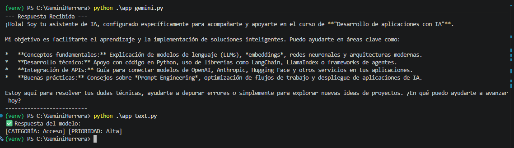

# IAKonrad
Project created for the asignature of development of apps whit IA in University Konrad Lorenz

To execute best form, this  system, yo need to know the next rules.

first step, you need to create the around system in python, and asign a name.

second step, you can execute this command in the terminal from VS Code: py -m venv env, this code allows to you asign the scripts and update the requirements, (in this case, the requirementes, is requierements, its a fail, but is good fail)

three step, you activate the script, this is: "env\scripts\activate"
Four Step, you edit the code and create the requirements for the IA Program and excute in the terminal: python .\app_text.py

This is all for this program, enjoy, and, sorry for the bad english, im learning

